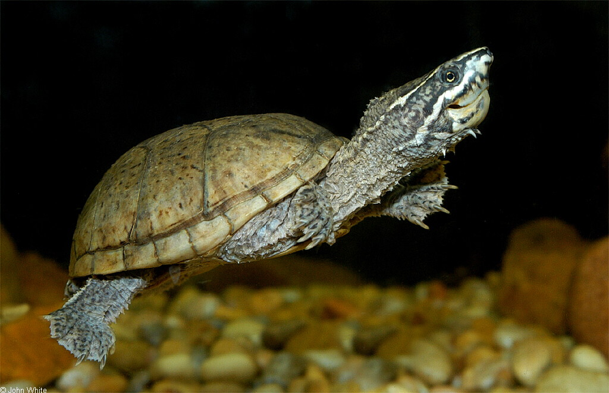
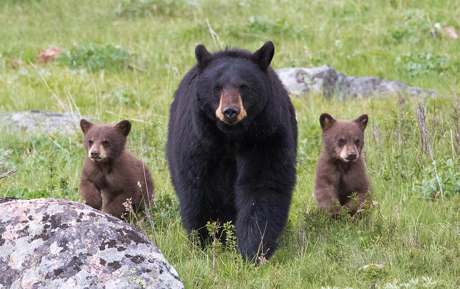
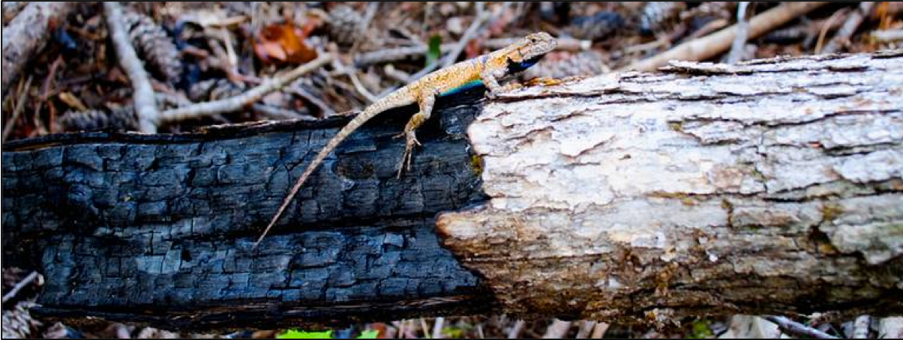

```{r setup, include=FALSE}
knitr::opts_chunk$set(echo = FALSE, include = FALSE)
```

##  {.tabset}

### As we have done before:

1.  Make a new project folder (directory) containing a .Rproj file. Use
    your last name as the first part of the file name (e.g.
    "Mylastname_practice").

2.  Open a blank script file (.R) and save it in your project folder

3.  Copy any necessary data files into the project folder.

4.  Load necessary libraries (library calls should be at top of script
    file)

```{r, include=TRUE, message=FALSE, warning=FALSE}
library(readr)
library(tidyr)
library(dplyr)
library(ggplot2)
library(emmeans)
library(multcomp)
```


### Practice 1

**Do mother turtles have high metabolism?**

{width="400"}

In a recent study, Thiem and Gienger (2022) found differences in
metabolism due to reproductive status in Eastern Musk Turtles
(*Sternotherus odoratus*). They found that after accounting for
variation in body mass (larger individuals have higher metabolism),
standard metabolic rate (SMR) differed between Males, Non-Gravid
Females, and Gravid Females (juveniles were excluded).

Please re-run their analysis to see if you are able to repeat their
results; report your results in the format for a scientific journal
article.

data = musk_turtle_metabolism.csv

First you will need to convert SMR (mL CO2/h) to energy units (Joules) rather
than volume of CO2 produced using the conversion: 1 mL CO2 = 24.32 J.

<https://pubmed.ncbi.nlm.nih.gov/35588475/>

A copy of the paper can be found in the project file for this exercise.

### Practice 2

**Are experienced mothers better at raising bear cubs?**

{width="400"}

 data = bear_cubs.csv

Is there an effect of litter type (single vs. multiple cubs) and effect of mother's experience level (first time vs. experienced) on weight gain in black bear cubs? Is there an interaction between these factors?

### Practice 2

**Fire and Lizard Sprint Speed**

{width="600"}

In a recent study at Land Between the Lakes, researchers tested whether lizards that live in different habitats respond differently to fire. They tested this by measuring sprint speed for lizards in three different burn treatments (control, recent burn, recovered burn). Because larger lizards (with longer legs) run faster than smaller lizards, they use hind limb length (mm) as a covariate.

After accounting for limb length, does sprint speed differ among lizards in the different burn treatments? Do the analysis for short runs (25 cm) and longer runs (2 m)?

data = lizard_sprinting.csv

https://zslpublications.onlinelibrary.wiley.com/doi/10.1111/jzo.12545

A copy of the paper can be found in the project file for this exercise.

```{r}
sprint <- read.csv("lizard_sprinting.csv")
```

```{r}
ggplot(sprint, aes(x = svl, y = speed_25cm, colour = site)) +
  geom_point() +
  geom_smooth(method = "lm", se=FALSE)+ 
  #this method allows regression lines to be heterogeneous
  theme_bw(15)
```
```{r}
model1<-lm(speed_25cm ~ hindlimb_mm*site, data=sprint)
summary(model1)
```
```{r}
model2<-lm(speed_25cm ~ hindlimb_mm+site, data=sprint)
summary(model2)
```
```{r}
anova(model1, model2)
```
```{r}
predictions_model2 <- predict(model2) 
#calculate regression lines ('predictions') from model2 by using
#every value of X to get the predicted value of Y
predictions_model2
```
```{r}
ggplot(sprint, aes(x = hindlimb_mm, y = speed_25cm, color = site) ) +
     geom_point() +
     geom_line(aes(y = predictions_model2)) +
  theme_bw(15)
```
```{r}
emmeans_25cm <- emmeans(model2, "site") %>% 
  multcomp::cld(Letters=letters) 
#site is the variable we want to compare
emmeans_25cm
```

